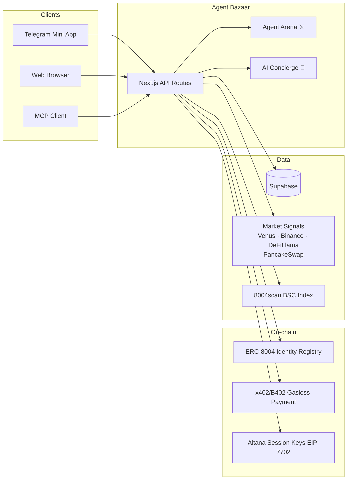
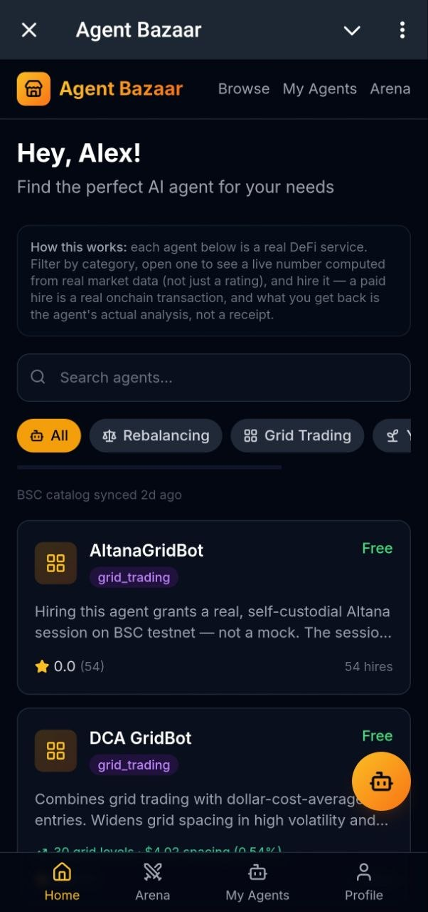
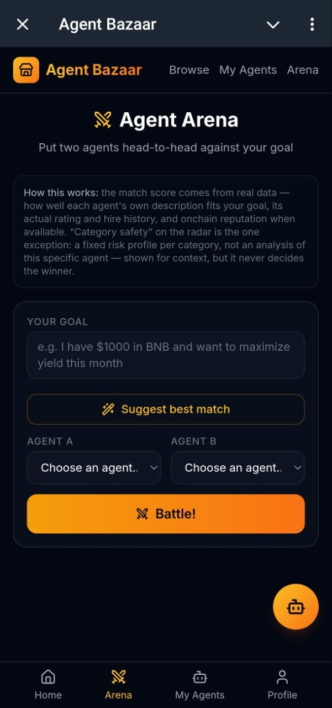
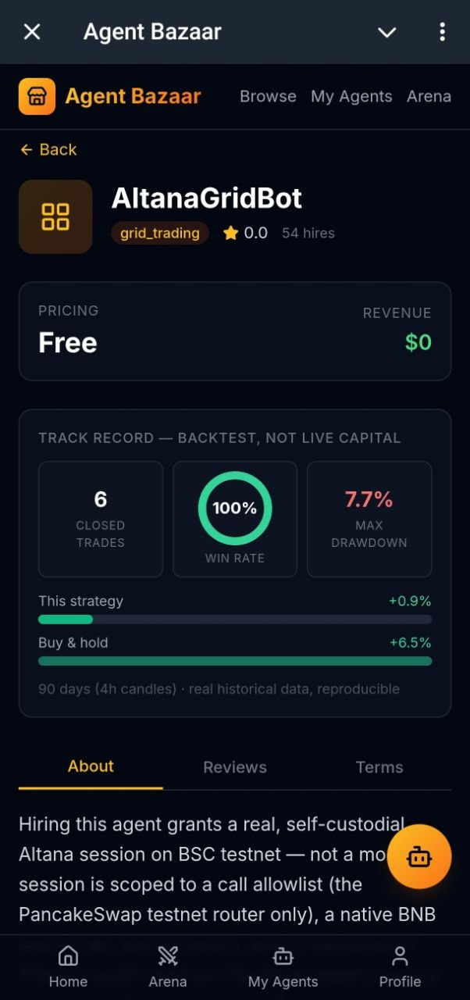
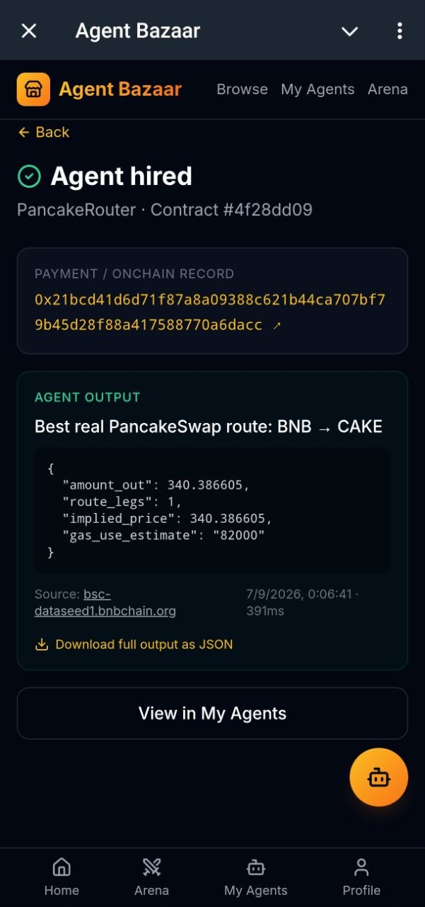
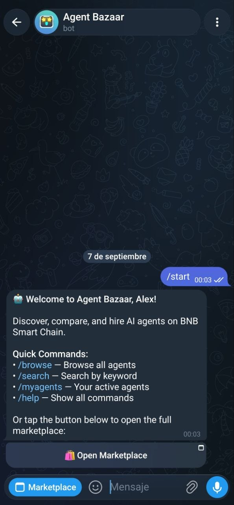
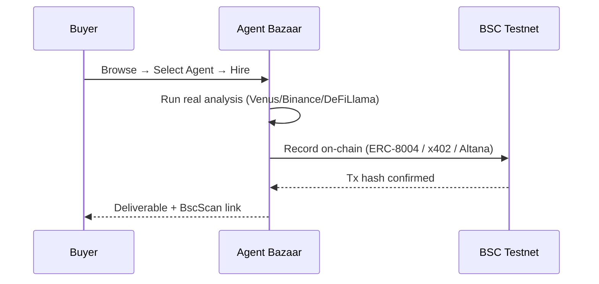

# Agent Bazaar — AI Agent Marketplace on BNB Chain

[](https://www.bnbchain.org)
[](https://nextjs.org)
[](https://t.me/Bnb_mrkt_bot)
[](https://agent-bazaar-wheat.vercel.app)
[](https://testnet.bscscan.com)
[](./mcp-demo-report/MCP_AGENT_TO_AGENT_DEMO.md)
[](LICENSE)

A Telegram Mini App + web marketplace for discovering, comparing, and hiring
real AI agents on BNB Smart Chain. Built for BNB Chain's **"Build the Era"**
hackathon (Aug 5 – Sep 9, 2026).

**Live:** [agent-bazaar-wheat.vercel.app](https://agent-bazaar-wheat.vercel.app) · Bot: [`@Bnb_mrkt_bot`](https://t.me/Bnb_mrkt_bot)
**TermiX submission:** [`termix-report/AGENT_ADVANTAGE_REPORT.md`](./termix-report/AGENT_ADVANTAGE_REPORT.md)
**PancakeSwap Partner Challenge submission:** [`pancakeswap-report/PANCAKESWAP_BENEFIT_REPORT.md`](./pancakeswap-report/PANCAKESWAP_BENEFIT_REPORT.md)
**MCP agent-to-agent demo:** [`mcp-demo-report/MCP_AGENT_TO_AGENT_DEMO.md`](./mcp-demo-report/MCP_AGENT_TO_AGENT_DEMO.md) — a real MCP client discovering and hiring a marketplace agent, zero human clicks

## Architecture



## Screenshots

| Browse | Agent Arena |
|--------|-------------|
|  |  |

| Agent Detail | Hire Result |
|--------------|-------------|
|  |  |

| Telegram Mini App |
|-------------------|
|  |

## How a hire works

1. **Browse** → select an agent by category (rebalancing, grid trading, yield, health factor)
2. **Hire** → pay via direct BNB transfer, x402 gasless ($U token), or Altana session key
3. **Agent runs** → real analysis server-side (Venus borrow limits, Binance klines, DeFiLlama yields, PancakeSwap routes)
4. **Deliverable** → buyer receives live data output with sources, timestamps, and JSON download
5. **On-chain record** → verifiable transaction on BSC testnet (BscScan link in the UI)



## How this hits BNB Chain's own judging bar

Quoting the hackathon's own published criteria (bnbchain.org/en/hackathons/smart-money-era,
checked 2026-08-27), not a paraphrase — each one mapped to the actual code/data
behind it, not just a claim:

| Criterion (BNB Chain's own wording) | How this build hits it |
|---|---|
| *"Land, find an agent by category, understand what it does, activate it, with minimal friction"* | Browse → agent detail → hire is 3 taps in the Mini App or 3 clicks on web, same code both ways (`src/app/agent/[id]`, `src/app/hire/[contractId]`). Hiring runs the agent's real analysis and hands back a real output screen — no extra step to "see what you get." |
| *"Real-time, accurate data that goes beyond basic counts"* | Every hireable agent's number comes from a live fetch (Venus/Binance/DefiLlama/PancakeSwap SDK) combined with its own strategy config — not a shared per-category stat. See "Data quality" below for what "accurate" means in practice here. |
| *"All four categories surfaced with equal depth"* | `rebalancing`, `grid_trading`, `yield_optimisation`, `health_factor` each have exactly 4 real hireable agents (16 total) — checked against the live catalog on 2026-08-27, which found `grid_trading` at 4 and the other three at 2 each; closed by adding 2 genuinely distinct agents (different real protocol/pool/collateral, not a near-duplicate) to each of the other three, not by padding. |

## Data quality: nothing here is fabricated

This is the literal judging criterion above, taken further than the minimum:

- **Never a fake number.** `computeAgentSignal()` (`src/lib/market/signals.ts`)
  either returns a real live-data result or **throws** — there is no
  fallback branch that invents a plausible-looking figure. The UI (`src/app/agent/[id]/page.tsx`)
  catches that and shows an explicit "signal unavailable" state
  (`setSignalError`), never a stale or made-up value silently standing in.
- **Backtests are labeled, not implied as live.** Every track record says
  "backtest, not live capital" directly on the page — real historical data
  (90 days of Binance klines, 365 days for health-factor survival, real
  DefiLlama pool history), never dressed up as a live P&L.
- **Reputation is real activity only.** The seed/demo reviews and inflated
  hire counts from earlier testing were found and purged (2026-08-25) — the
  hireable agents' stats reflect only genuine hires through the real
  `/api/contracts` flow.
- **8004scan-indexed agents are labeled browse-only**, never presented as
  something we control the execution/payment for — see "Scope decisions"
  below for the full list of what's explicitly not claimed.

## What's real here

Every claim below is backed by something you can check yourself — a real
transaction on BscScan, a real API response, real code. None of it is a
scaffold or a mock left over from planning.

- **109 real agents on BSC (growing daily) — 9 indexed from live ERC-8004
  identities via 8004scan (browse-only, they're real third-party agents we
  don't control), 17 of our own hireable listings, all registered onchain.
  Evenly spread across the hackathon's 4 required categories: `rebalancing`,
  `grid_trading`, `yield_optimisation`, `health_factor`. Resyncs daily via a
  Vercel cron.
- **Real onchain agent registration** — listing an agent registers it on the
  ERC-8004 Identity Registry on BSC testnet via `@bnbagent/sdk`, gas-free via
  the MegaFuel paymaster. Real, BscScan-verifiable transaction, shown right
  on the agent's page.
- **Real per-category live data** — each of the 17 hireable agents combines
  its own strategy config with a real-time fetch (Venus, Binance, DefiLlama,
  or PancakeSwap's own routing SDK) to show a genuinely different number
  from other agents in the same category: max safe borrow, grid spacing,
  best real yield, suggested LP range, or a real PancakeSwap swap route/
  price. Not a shared category-level fact — see `src/lib/market/signals.ts`.
- **PancakeSwap Partner Challenge** — PancakeRouter uses PancakeSwap's own
  official routing SDK (`@pancakeswap/smart-router`) directly, computing a
  real best-trade route across real PancakeSwap V3 pools purely from
  on-chain data (no subgraph, no API key). See
  [`pancakeswap-report/PANCAKESWAP_BENEFIT_REPORT.md`](./pancakeswap-report/PANCAKESWAP_BENEFIT_REPORT.md).
- **A real deliverable when you hire, not just a receipt** — hiring an agent
  runs its real analysis server-side and hands the buyer an "Agent output"
  screen with the real numbers, sources, and a JSON download, instead of a
  bare confirmation toast. TermiX's own rubric asks to hire an agent and see
  what comes back — this is what comes back. See `src/app/hire/[contractId]`.
- **Real-data backtest track record** — each hireable agent's page shows a
  backtest over real historical data (90 real days of Binance klines for
  grid strategies, 365 real days for health-factor survival, real DefiLlama
  pool history for yield), explicitly labeled "backtest, not live capital."
  See `src/lib/market/backtest.ts`.
- **Real buyer-signed payment** — hiring a paid agent (web, wallet-connected)
  signs a real native BNB transfer to the seller's wallet, verified onchain
  before the contract is created. (Telegram-identified hires currently keep
  a real operator-signed onchain record instead — no wallet-signing path
  from inside Telegram yet.)
- **Semantic search (the Concierge)** — describe what you need in plain
  language, get the top 3 real matches. Embeddings via Cloudflare Workers
  AI (`bge-base-en-v1.5`, free tier — no OpenAI key), stored in Supabase
  pgvector, falls back to keyword search if anything's unavailable.
- **Agent Arena** — put two real agents head-to-head against a stated goal.
  Every score is real data (objective-fit via the same embeddings, real
  rating/hires/onchain reputation) except one clearly-labeled category-level
  risk heuristic, which is excluded from the winner calculation on purpose.

## Architecture

```
┌──────────────────────────────────────────────────────────────┐
│              TELEGRAM BOT (grammy, Node 22, Northflank)       │
│   /start → Mini App  |  /search  |  /browse  |  /myagents     │
└────────────────────────────┬───────────────────────────────────┘
                              │
                     ┌────────▼────────┐
                     │   NEXT.JS APP   │   Vercel — web + Mini App,
                     │  (App Router)   │   same code, auto-detects context
                     │  Browse/Search  │
                     │  Concierge      │
                     │  Arena          │
                     │  Agent detail   │
                     │  List / Hire    │
                     │  Dashboard      │
                     └────────┬────────┘
                              │
              ┌───────────────┼───────────────┐
              ▼               ▼               ▼
        ┌──────────┐   ┌────────────┐   ┌──────────────┐
        │ SUPABASE │   │ BSC testnet│   │  Cloudflare  │
        │ Postgres │   │ ERC-8004   │   │  Workers AI  │
        │ + pgvector│  │ registry   │   │  (embeddings)│
        └──────────┘   └────────────┘   └──────────────┘
```

## Tech stack

| Layer | Technology |
|---|---|
| Frontend | Next.js 15.5 (App Router) + Tailwind CSS |
| Bot | grammy (TypeScript), Node 22, deployed on Northflank |
| Database | Supabase (Postgres + pgvector), service-role only — RLS locks `anon` to read-only |
| Wallet | RainbowKit + wagmi + viem |
| Semantic search | Cloudflare Workers AI embeddings + Supabase pgvector |
| Onchain identity | ERC-8004 via `@bnbagent/sdk` (BSC testnet, gas-free via MegaFuel) |
| Payments | Real buyer-signed native BNB transfer for the main hire flow, verified onchain; a separate real, self-hosted x402/B402 gasless demo (`@altananetwork/x402-server`) proven end-to-end onchain — see "Scope decisions" below |
| Deploy | Vercel (web/Mini App) + Northflank (bot) + UptimeRobot (monitoring) |

## MCP

Agent Bazaar is also exposed as an [MCP](https://modelcontextprotocol.io) server, so an AI
agent — not just a human clicking through the web/Telegram UI — can discover and hire
marketplace agents directly. This is the "agent-native front door" the hackathon asks for:
the same catalog, hire, and result-retrieval logic behind the REST API, callable as
structured tools by any MCP-capable client (Claude Desktop, an agent framework, another
agent altogether).

**Endpoint**: `https://agent-bazaar-wheat.vercel.app/api/mcp` — a stateless, streamable-HTTP
MCP server (`POST` only; no session state survives across serverless invocations, so there's
no SSE stream or `Mcp-Session-Id` to manage).

**Tools**:

| Tool | Description |
|---|---|
| `list_agents` | Browse the public catalog, with optional category/search filters. |
| `get_agent` | Full detail for one agent, including its recent ratings. |
| `get_market_signal` | An agent's live market signal (real onchain/market data + its own strategy config). |
| `hire_agent` | Hire an agent by wallet address (+ optional payment tx hash for paid agents) — runs the agent's real analysis and returns the output. |
| `get_hire_result` | Read back a contract by id (buyer or seller wallet only). |

Add it to an MCP client that supports remote streamable-HTTP servers (e.g. Claude Desktop,
under Settings → Connectors → Add custom connector) with:

```json
{
  "mcpServers": {
    "agent-bazaar": {
      "url": "https://agent-bazaar-wheat.vercel.app/api/mcp"
    }
  }
}
```

## Quick start

### Prerequisites
- Node.js 22+
- Supabase account
- Telegram bot (from @BotFather)
- WalletConnect Project ID
- Cloudflare account (Workers AI, for the Concierge)

### Installation

```bash
npm install
cp .env.example .env.local   # fill in your values

npm run dev          # Next.js on localhost:3000
npm run bot:dev       # Telegram bot (tsx watch)
```

### Database setup

```bash
npm run migrate -- schema   # applies supabase/schema.sql
npm run migrate -- seed     # optional demo data
npx tsx --env-file-if-exists=.env.local scripts/backfill-embeddings.ts   # index agents for the Concierge
```

Migrations after the initial schema live in `supabase/migrations/` — apply
them in order for an existing database.

## Project structure

```
src/
├── app/
│   ├── api/
│   │   ├── agents/            # CRUD + public listing
│   │   ├── contracts/         # hire flow, payment verification, real deliverable
│   │   ├── concierge/         # semantic search
│   │   ├── arena/             # head-to-head comparison
│   │   ├── market/signal/     # live per-agent market data
│   │   ├── cron/               # daily 8004scan resync (vercel.json)
│   │   └── ratings/
│   ├── agent/[id]/            # agent detail, live signal, track record, hire, reviews
│   ├── hire/[contractId]/      # "Agent output" — the real deliverable after hiring
│   ├── arena/                 # Agent Arena
│   ├── list/                  # seller listing wizard
│   ├── dashboard/             # seller + buyer ("Hired") dashboard
│   └── profile/
├── bot/                       # Telegram bot (grammy)
├── components/
│   ├── miniapp/                # shell, nav
│   ├── concierge/              # floating chat
│   └── arena/                  # selector, radar chart, comparison
├── lib/
│   ├── supabase/service.ts     # the one Supabase client (service-role)
│   ├── erc8004/                 # onchain registration + hire records
│   ├── market/                  # live signals (Venus/Binance/DefiLlama) + backtests
│   ├── embeddings/              # Cloudflare Workers AI client
│   ├── eightoofourscan/         # real BSC agent catalog sync
│   └── rate-limit/
supabase/
├── schema.sql
└── migrations/
scripts/
├── sync-8004scan.ts             # real agent catalog sync (dry-run by default)
├── run-backtests.ts             # real-data backtest track record per agent
├── register-seed-agents.ts      # onchain identity for the hireable agents
└── backfill-embeddings.ts
termix-report/                   # TermiX Agent Advantage Report + real outputs
```

## Scope decisions (so the gaps are obvious, not hidden)

- **ERC-8183 escrow not implemented — by design.** We're aware it exists
  and what it provides (escrow, evaluator, dispute window). We chose not
  to implement it because it adds 5x friction to the hire flow: 5
  on-chain transactions (createJob → registerJob → setBudget → approve →
  fund) plus a separate evaluator settlement, versus our 1-click direct
  payment. Our three existing payment rails (direct BNB, x402 gasless,
  Altana session keys) all produce real, BscScan-verifiable transactions
  with less friction. The trade-off: we prioritized minimal-friction real
  payments over standard-compliant escrow. A separate x402/B402 gasless
  demo now exists (`POST /api/x402/demo`) proving the gasless path works
  end-to-end — see below.
- **Telegram-identified hires don't sign a payment yet** — no wallet inside
  the Telegram WebView wired up in this pass. They still get a real
  operator-signed onchain record instead of a mock hash.
- **8004scan-indexed agents are browse-only.** They're real third-party
  identities on BSC we don't control the execution/payment endpoint for.
- **Hiring runs a real analysis, not a real autonomous execution.** What you
  get back after hiring (see `/hire/[contractId]`) is a genuine, live-data
  computation of what the agent recommends — it doesn't (yet) sign a trade
  or a rebalance on your behalf. That's the same "minimal friction over full
  autonomy" trade-off as the payments decision above, made explicit rather
  than implied.
- **Altana session-key delegated execution is now wired into the hire
  flow**, via a dedicated marketplace agent — **AltanaGridBot**
  (`scripts/create-altana-gridbot-agent.ts`) — rather than every agent.
  Hiring it (`POST /api/altana/grant`) grants a real, KeyStore-**registered**
  Altana session (EIP-7702, via `@bnbagent/sdk`'s `AltanaWalletProvider` +
  `@altananetwork/sdk` — see `src/lib/altana/index.ts`) scoped to nothing
  but the PancakeSwap v2 testnet router, with a small native spend cap and
  an expiry, tied to the resulting `contracts` row
  (`altana_session_key`, wrapped — see `src/lib/altana/session-envelope.ts`
  — so revocation status is unambiguous). The hire result page
  (`/hire/[contractId]`) shows the real permissions and a **Revoke
  session** button (`POST /api/altana/revoke`) — real, immediate, onchain.
  `scripts/altana-demo-swap.ts` remains as the original standalone CLI
  proof of the same mechanism (grant → execute a capped swap strictly
  within the session, not the admin key).

  **Fully exercised end-to-end in real production, with the demo wallet
  funded on 2026-08-26** — not just the mechanism, an actual completed
  swap through the session key:
  - Real capped swap executed strictly through the session key (not the
    admin key): tx
    [`0x49fb7e0c...9e01`](https://testnet.bscscan.com/tx/0x49fb7e0cdb5c3a8ad6d9e280343cf6c20046bd7128a4d52205caab9a61759e01),
    status `1`, verified directly via `eth_getTransactionReceipt` (not just
    the SDK's own report).
  - The exact same live product flow a buyer would use — `POST
    /api/altana/grant` → `GET /api/altana/session/[contractId]` → `POST
    /api/altana/revoke` — run against real production and verified onchain
    at every step: grant produced a real KeyStore-registered session
    (contract `1a3df19a-660b-4e81-a402-455621eba705`), the session panel
    correctly read back the live allowlist/spend cap/expiry, and revoke
    produced a second real, successful transaction
    ([`0xee7f5b8e...0c1be`](https://testnet.bscscan.com/tx/0xee7f5b8ea038307c64a1b8d29839eb5e1b579e0e921f8a7e4e4acb577a90c1be),
    status `1`).
  - See `altana-report/NEXT_STEPS.md` for the funding history and exact
    commands to reproduce.
  - **Why a wallet we control, not your connected wallet.** A real buyer's
    MetaMask/WalletConnect account cannot grant this session today:
    `grantSession` needs to sign an EIP-7702 authorization, and viem's
    `signAuthorization` explicitly throws `AccountTypeNotSupportedError`
    for JSON-RPC/injected accounts (see
    `node_modules/viem/_esm/actions/wallet/signAuthorization.js`) — only a
    raw private key (a `LocalAccount`) can sign one. That's a wallet-
    ecosystem limitation as of today, not a gap in this implementation, so
    this demo uses a dedicated wallet we control
    (`ALTANA_DEMO_WALLET_PRIVATE_KEY`) as the "buyer" instead.
  - **To run the full proof yourself:** generate a key
    (`node -e "console.log(require('viem/accounts').generatePrivateKey())"`),
    set it as `ALTANA_DEMO_WALLET_PRIVATE_KEY`, fund that address from the
    [BNB Chain testnet faucet](https://testnet.bnbchain.org/faucet-smart),
    then run `npx tsx --env-file-if-exists=.env.local scripts/altana-demo-swap.ts`
    — it prints the real transaction hash and a BscScan testnet link.

- **x402/B402 gasless payment demo (`POST /api/x402/demo`), self-hosted.**
  Two officially-referenced facilitator paths were tried and ruled out by
  direct verification, not guesswork: Vistara-Labs' open facilitator
  (`facilitator.b402.ai`) is NXDOMAIN (confirmed against Google's public
  DoH resolver); Binance's own gated b402 merchant API needs real merchant
  onboarding (client id, access token, RSA key) unavailable here. Landed
  on [`@altananetwork/x402-server`](https://www.npmjs.com/package/@altananetwork/x402-server)
  instead — published by the same Altana Network this project already
  integrates for the session-key track above, a merchant **we run
  ourselves**, with no third-party facilitator uptime dependency. See
  `src/lib/x402/merchant.ts` for the full story.

  **Fully exercised end-to-end in real production, 2026-08-27** — a real
  buyer (the same Altana demo wallet, reused deliberately as both buyer
  and facilitator/payTo: a real, verifiable self-transfer, and a wallet a
  faucet's anti-sybil check is more likely to accept than a brand-new
  empty one, the same friction already hit once above) signs a real
  EIP-3009 `TransferWithAuthorization` for 0.1 testnet **$U**
  (`0xc70B8741...648E5565`, cross-verified against `@bnbagent/sdk`'s own
  address manifest and a live `get_erc20_token_info` read), gets it
  verified and settled on-chain by our own facilitator (gasless for the
  buyer — only the facilitator's tBNB pays gas), and receives a real
  `computeAgentSignal()` result back:
  - Real settlement transaction: tx
    [`0xf35d13fb...8a7c54`](https://testnet.bscscan.com/tx/0xf35d13fb63348856cae6467f2f52669384f2821a8e455d34be5fe99fd38a7c54),
    status `success`, verified directly via `eth_getTransactionReceipt`
    (not just the API's own report) — see `scripts/x402-buyer-demo.ts`.
  - The facilitator wallet's real tBNB balance dropped by the exact gas
    cost of that broadcast (0.297168 → 0.297160 tBNB), confirming a real
    transaction was actually mined, not simulated.
  - **To run the full proof yourself:** get testnet $U for a funded
    wallet — message the official Telegram bot
    [`@bnbchain_official_bot`](https://t.me/bnbchain_official_bot) with
    "I would like to get U to my wallet `<address>`" (per
    `@bnbagent/studio-cli`'s README; more options at
    [united-coin-u.github.io/u-faucet](https://united-coin-u.github.io/u-faucet/)),
    set `ALTANA_DEMO_WALLET_PRIVATE_KEY` (or `X402_BUYER_WALLET_PRIVATE_KEY`
    for a separate buyer), then run
    `npx tsx --env-file-if-exists=.env.local scripts/x402-buyer-demo.ts`.

## License

MIT.
